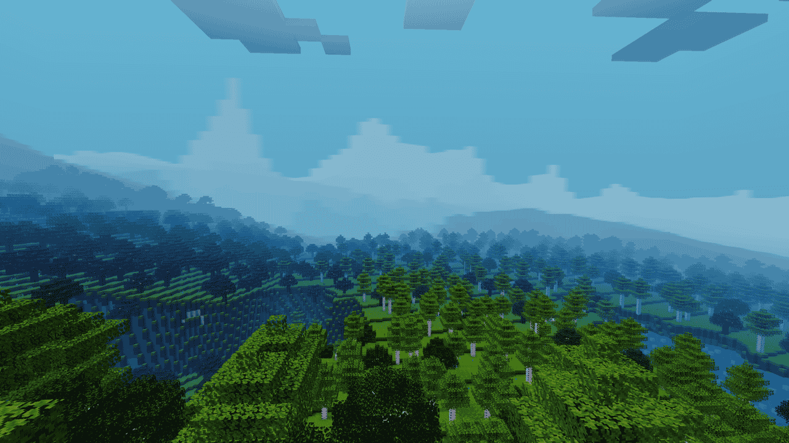
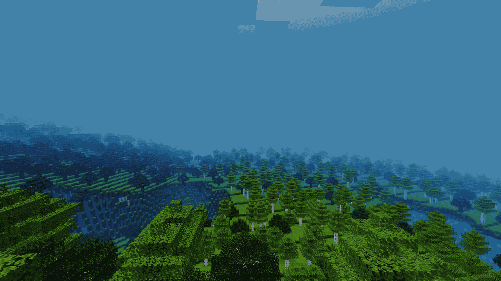

plains55
========

This Luanti mod is a mapgen and a skybox at the same time.

To use it, select the singlenode mapgen and activate the mod.

It works with at least Minetest Game.

It does not work with games that set their own skyboxes.

Ideally it would want to display transparent textures, rendered after the skybox, the sun and the moon, but before anything else is rendered. Luanti doesn't have such an API yet AFAIK.

This mod takes advantage of the rendering being so large scale and coarse that noise based rendering is enough and no player made structures need to be represented. This brings the resource needs to a minimum and the "draw distance" to many thousands.

It really needs engine additions though, because there's only one skybox and in many games it's already in use. And the client will never free the dynamic textures

The point in combining the mapgen with the skybox is that this isn't general purpose rendering. Being tailor-made for the map generation makes an otherwise very difficuit and resource intensive process very laid back as the skybox roughly knows how the mapgen will behave and look like, and can easily match it. Similarly, the mapgen knows what the skybox is capable of, and is designed to generate stuff that works well with it
